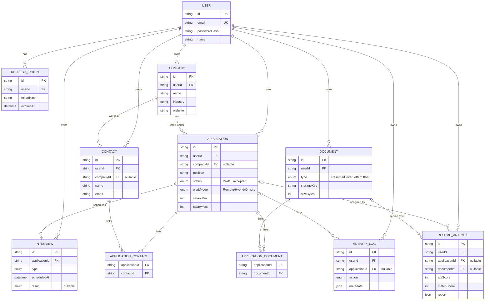

# JobTrail — API

Modular-monolith REST API for JobTrail, a multi-user job-search CRM: auth, companies, applications (Kanban status), interviews, contacts, documents, an activity log, a reminders feed, an **AI-assisted résumé/ATS analysis** engine, AI cover letters, **RAG-grounded résumé tailoring**, and an in-app rich-text **document editor**.

[](https://github.com/AngeloCP-01/SmartJobSearch-BE/actions/workflows/ci.yml)
&nbsp;**[▶ Live demo](https://jobtrail-hq.vercel.app)** · **[Frontend repo](https://github.com/AngeloCP-01/SmartJobSearch-FE)** · **[Deploy guide](./DEPLOY.md)**

## Stack

Node.js · Express · PostgreSQL (Prisma) · JWT (access + httpOnly refresh cookie) · Zod · multi-provider LLM routing (NVIDIA NIM + OpenRouter) · pgvector (RAG) · Jest + Supertest. Deployed on Render + Neon + Supabase Storage.

**Deployment & infrastructure** (all free-tier):

| Concern | Service |
|---|---|
| **API host** | Render (Express) — `/api/health` kept warm by a GitHub Actions keep-alive ping |
| **Database** | Neon (serverless Postgres + `pgvector`), via Prisma |
| **File storage** | Supabase Storage (S3-compatible, via `@aws-sdk/client-s3`) |
| **AI (LLM + embeddings)** | NVIDIA NIM primary (`integrate.api.nvidia.com`), OpenRouter fallback — one `<provider>:`-prefixed model chain |
| **Error tracking** | Sentry (`@sentry/node`; auth headers scrubbed before send) |
| **Logging** | pino / pino-http structured logs, drained to **Sentry Logs** |
| **Uptime monitoring** | UptimeRobot — HTTP(s) monitor on the health endpoint |
| **CI** | GitHub Actions — Jest + Supertest against a Postgres service container |

The companion frontend (Vercel) adds **Vercel Web Analytics + Speed Insights** for traffic and Core Web Vitals; see the [frontend repo](https://github.com/AngeloCP-01/SmartJobSearch-FE).

## Architecture

A **modular monolith** — one module per domain, each with its own `routes → controller → service → schema` and integration tests, sharing a thin infra layer.

```
src/
  modules/
    auth/ companies/ applications/ interviews/ contacts/
    documents/ authored-documents/ images/ activity/ analysis/ rag/
    postings/ reminders/ dashboard/
  shared/
    database/   (Prisma client singleton)
    storage/    (save/createReadStream/remove/readBuffer — local-disk or S3 driver)
    middleware/ utils/
  routes/index.js   app.js   server.js
prisma/schema.prisma   prisma/seed.js
tests/
```

### Engineering highlights

- **Resilient auth** — short-lived access JWT + rotating refresh token in an httpOnly cookie; cross-site `SameSite=None; Secure` in production.
- **AI with a safety net** — a `<provider>:`-prefixed model chain spans **NVIDIA NIM + OpenRouter**, fast-fails on 429 rate-limits / timeouts to the next model, and the ATS analysis falls back to a deterministic keyword matcher so it never hard-fails; all outputs are Zod-validated.
- **RAG-grounded tailoring** — résumé-tailoring suggestions are retrieved from the user's own documents via **pgvector** (NVIDIA embeddings, HNSW cosine, `userId`-scoped) with a **no-fabrication backstop** so the model can't invent experience.
- **Swappable storage** — a `save/createReadStream/remove/readBuffer` interface backs both local disk (dev) and S3-compatible object storage (prod, e.g. Supabase/R2) so uploads survive an ephemeral-disk host. Chosen by one env var; no caller changes. A read failure surfaces as a friendly **503**, not a raw 500.
- **Per-user isolation** — every query is scoped to the authenticated user; tests assert one user can’t read/modify another’s data.
- **Production observability** — errors go to Sentry (auth headers scrubbed, `sendDefaultPii: false`), requests/events are logged as structured pino JSON and drained to Sentry Logs, and UptimeRobot polls the health endpoint. Both Sentry and the AI layer are inert without their env vars, so local dev and CI make no external calls.

## Data model

Generated from [`prisma/schema.prisma`](./prisma/schema.prisma). Every record is owned by a `User`; `Application` is the hub that ties companies, interviews, contacts, documents, activity, and AI analyses together. `ApplicationContact` and `ApplicationDocument` are explicit many-to-many join tables.



## Prerequisites

- Node.js 20+
- Docker (for local Postgres)

## Setup

```bash
docker compose up -d                                                   # Postgres on host port 5434
docker compose exec db psql -U crm -d jobcrm -c "CREATE DATABASE jobcrm_test;"   # one-time, for tests
cp .env.example .env
npm install
npm run migrate                                                        # apply migrations + generate client
npm run dev                                                            # http://localhost:4000
npm run seed                                                           # optional: load the demo dataset
```

> **Port note:** local Postgres is published on **5434** to avoid clashing with other Postgres on 5432. `.env` / `.env.test` already point there.

## Tests

```bash
npm test    # Jest + Supertest against jobcrm_test; global setup migrates a schema per worker
```

Every module covers happy paths, validation errors, auth requirements, and cross-user isolation. CI runs the suite against a Postgres service container on every push/PR.

The suite is **parallel-safe**: each Jest worker runs against its own freshly-migrated Postgres schema (`test_w<JEST_WORKER_ID>`, provisioned in `globalSetup`), so the per-test truncations never collide across workers — no `--runInBand` needed, and it scales across cores.

## API

All routes are under `/api`; authenticated requests send `Authorization: Bearer <accessToken>` and the refresh token rides in an httpOnly cookie scoped to `/api/auth`.

| Area | Endpoints |
|------|-----------|
| Health | `GET /health` |
| Auth | `POST /auth/register` · `/login` · `/refresh` · `/logout` · `GET /auth/me` |
| Companies | `GET /companies?search=` · `POST` · `GET/PATCH/DELETE /companies/:id` |
| Applications | `GET /applications?status=` · `POST` · `GET/PATCH/DELETE /:id` · `PATCH /:id/status` |
| Interviews | `GET /interviews?applicationId=` · `POST` · `GET/PATCH/DELETE /:id` |
| Contacts | `GET /contacts` · `POST` · `GET/PATCH/DELETE /:id` · link/unlink to applications |
| Documents | `GET /documents` · `POST` (multipart; PDF/DOC/DOCX/TXT) · `GET /:id/file` · `PATCH/DELETE /:id` · link/unlink |
| Analysis | `POST /analysis` · `GET /analysis` · `GET /:id` · `DELETE /:id` · `GET /analysis/config` · `POST /analysis/cover-letter` (AI) |
| Postings | `POST /postings/parse` — AI-extract application fields from pasted text/URL |
| Activity | `GET /activity?applicationId=&cursor=` |
| Reminders | `GET /reminders` |
| Dashboard / Analytics | `GET /dashboard/summary` · `GET /analytics` |

## Deployment

Full free-tier walkthrough (Neon + Supabase + Render + Vercel), with the cross-origin cookie/CORS gotchas, in **[`DEPLOY.md`](./DEPLOY.md)**.
